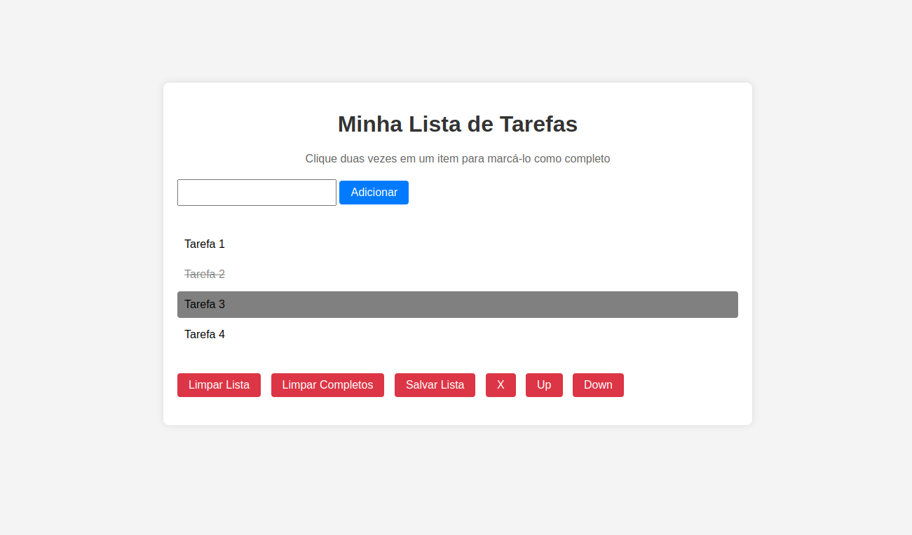

# README: To do list



## Project Description

This is a task management application for a to-do list. You can add tasks and click on them to mark them as completed. Additionally, you have the option to clear the entire list or only the items that have been marked as completed. Furthermore, you can rearrange tasks by moving them up or down. The application also allows you to save tasks in local storage, ensuring that the data persists when you reopen the page.

### Technologies

- LINUX
- VSCODE
- HTML
- CSS
- LOCAL STORAGE
- JAVASCRIPT

### What I Learned

- How to save data in local storage
- How to add class and styles using event listener

## How to Run the Project

1. Clone the repository:

   ```bash
   git clone https://github.com/feduarte-dev/color-guess
   ```

2. Navigate to the project directory:

   ```bash
   cd your-repository
   ```

3. Install dependencies:

   ```bash
   npm install
   ```

4. Run application:

   ```bash
   Right click index.html and open it with live server
   ```

## Contributions

[Felipe](https://www.linkedin.com/in/feduarte-dev/) - index.html - style.css - script.js


[Trybe](https://www.betrybe.com/) - Everything else
